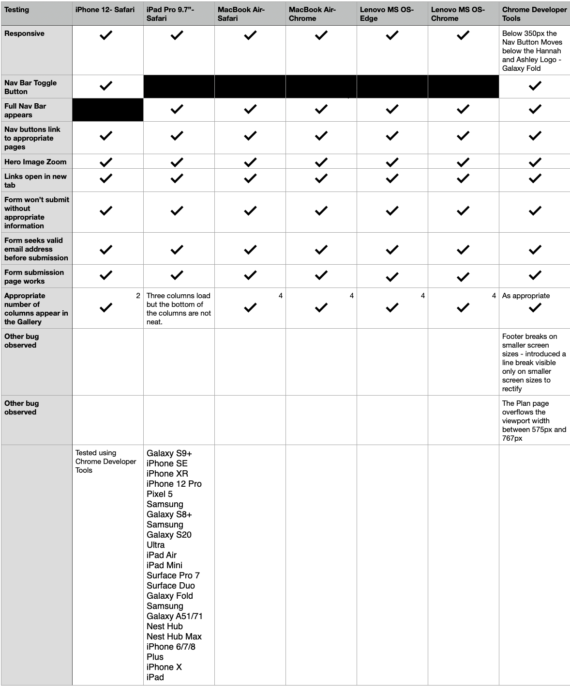

# Ashley & Hannahs Vow Renewal
***
[View Live project here](https://janebmckenna.github.io/milestone-project-1/)

Ashley & Hannahs Vow Renewal is a site that provides Wedding Day information for the friends and family of the couple. The website displays photos of the celebration which happened during COVID, information for guests coming to their renewal and collects RSVPs. 

## Index – Table of Contents
***
- [Ashley \& Hannahs Vow Renewal](#ashley--hannahs-vow-renewal)
  - [Index – Table of Contents](#index--table-of-contents)
  - [User Experience UX](#user-experience-ux)
  - [UX Scope](#ux-scope)
    - [Existing Features](#existing-features)
    - [Future Improvements](#future-improvements)
  - [UX Structure](#ux-structure)
    - [Navigation and Header](#navigation-and-header)
  - [UX Skeleton](#ux-skeleton)
    - [Design Choices](#design-choices)
  - [Technologies Used](#technologies-used)
  - [Testing](#testing)
  - [Deployment](#deployment)
  - [Credits](#credits)

## User Experience UX
***
**Strategy**

The goal is to  to provide a simple, intuitive and informative website for the vow renewal of Hannah and Ashley. Which guests will navigate easily to respond to their invitation, find useful information and browse images of the original wedding day during the covid 19 pandemic.

**Customers: Hannah and Ashley**

Website provides them with a means to communicate the details of their vow renewal, capture RSVPs and share content from the first time around.

**Users:**

Users are close friends and family of Hannah and Ashley they are interested in their story, viewing their pictures, RSVPing to their invite, the details of the day, what to expect and what accommodation is convenient 

**User Stories:**

_As a FIRST TIME user of the site I want to be able to:_
* Intuitively and easily navigate the site to find content.
* Respond with my RSVP.
* Be able to establish the particulars and timings of the vow renewal.
* Browse the photos of the original Wedding Day.

_As a RETURNING user of the site I want to be able to:_
* Confirm timings and arrangements for the day.
* Find links to accommodation and venues.
* Browse the photos of the original Wedding Day.

## UX Scope 
### Existing Features

**Navigation Bar**

- Featured on all pages the design and layout of the navigation are consistent on each page. 
- On Mobile or small/medium screens there is a toggle button for the Navigation options. Users are familiar with this approach and it will be intuitive for them to use. 
- On desktop or large screen devices the navigation is expanded to show all the page options and the current page is subtly highlighted. 
- The Navigation will allow users to easily navigate the site without having to using the back button within the browser. 

**Home Page - Hero Image and Introductory Text**

- Provides a striking image of Ashley and Hannah immediately when the site is opened and sets the tone for the site. 
- Provides a clear explanation of why the vow renewal is happening and asks the user to join the celebration. 

**Home Page - Wedding Video**

- Builds excitement by showing the highlights of the original Wedding day.
- Gives a taste of what to expect to those who couldn't be at the original day.

**Footer**

- Provides easy access to links for the two venues for the day, the links will open in new tabs to aid user experience. 
- On large screens and desktops the date fo the Vow Renewal will also display. 

**The Plan**

- Provides details of the date, location and timings of the Vow Renewal. 
- Where and when the various aspects will occur.
- Full address and google maps links for the venues to make planning easier for guests. 

**Accommodation Suggestions**

- This will provide a list of a few suggestions for local accommodation including contact details and also a link to booking.com where additional options can be found. 

**RSVP Form**

- This will allow users to respond to their invite to the wedding, provide suggestions for great dance floor music and inform of any dietary requirements they may have. 

**Photo Gallery**

- This section will allow users to get a feel for what the day was like last time and importantly view photos Ashley and Hannahs special day.

### Future Improvements

These features are beyond the scope of this project but I would look to include for the final live version of the site

- Active RSVP form.
- Guestbook to allow guests to comment and post well wishes. 

## UX Structure

### Navigation and Header

## UX Skeleton

### Design Choices

- I envisaged that this site would predominantly be used on Mobile. I made the choice to use bootstrap to facilitate my design and I scaled from Mobile first.
- 
  
**Mobile view 579px**

**Tablet view 768px**

**Desktop view 1200px**

## Technologies Used

## Testing

**Lighthouse Audit**

When I initially ran the lighthouse audit I found issues with my images sizes impacting load time, I rectified this by resizing the images and changing the format from .img to .WebP.

**Validator Testing**

- HTML

No errors were returned when passing through the W3C validator 

- CSS

When I initially passed the site through the Jigsaw Validator it returned a lot of errors originating from bootstrap/java script. I made the decision to test me CSS directly through direct input on the validator. 
One error and one warning was returned when tested through direct input on Jigsaw. 

## Deployment
The Website has been deployed using GitHub Pages [Here](https://janebmckenna.github.io/milestone-project-1/) using the method below: 
- I logged into my GitHub account.
- I opened my repository for this site. 
- Within the repository I selected 'Settings'
- I navigated to 'Pages' within 'Settings'
- I selected 'Deploy from a branch' from the source menu then the 'Main' branch along with the 'root' folder.
- I then saved the options to deploy the site. 

## Credits

**Content**

- I used [colormind.io](http://colormind.io/) to decide on the colour scheme of the site. I wanted the palette to fit with the imagery I intended to use.
- Icons were sourced from [Font Awesome](https://fontawesome.com)
- My fonts were taken from [Google Fonts](https://fonts.google.com/)
- [Bootstrap Version 4.3](https://getbootstrap.com/docs/4.3/getting-started/introduction/)
- Wireframes were created using [Balsamiq](https://balsamiq.com/)

**Code**

- While writing the project i referred back to pieces of code I had written during the course. 

    **Gallery Page**
    I liked the layout of the Gallery on the love running project so I referred 
    back to to to guide my code for the Gallery on this site. I felt however 
    that 3 collumns was more appropriate for tablet view. 

    **Plan Page**
    I felt the code from my resume project which showed the timeline of 
    employment was a nice excecution of a timeline. I referenced back to this 
    code to write the code for the Plan page. 

- Youtube video

I took the embed code for the youtube video I wanted to use and edited the code for my own needs. I changed the display properties, the accesibillity and the attributes for the code. 

- Google Maps

I took the embed code from Google Maps for the two loctions I needed for the project. I then added a title for accesibility purposes. 

**Images**

All images used within the project came from personal sources. The wedding imagery is from Ashley and Hannahs Wedding and was used with their permission. The three accommodation images were sourced from the marketing department at work and used with their blessing to create fictitious accommodation in Mohill. 
I thank my sister Hannah, brother in law Ashley and Marketing Manager Ross for their assistance in providing photography. 

**Advice**

Thank you to my mentor for all the help and advice he has offered including:
- An elegant solution for form submission on a static site. 
