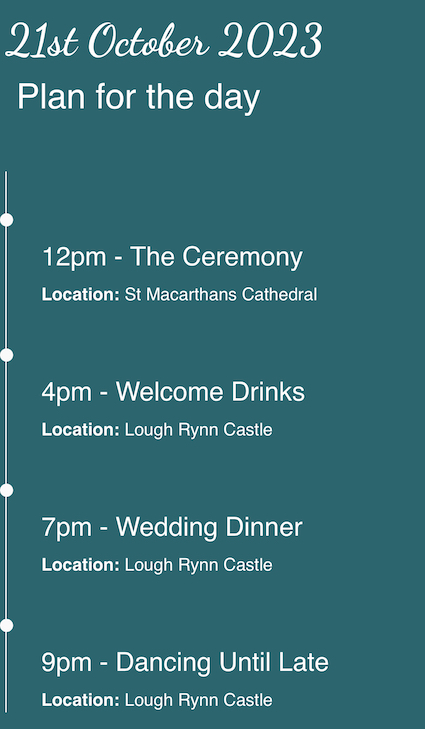
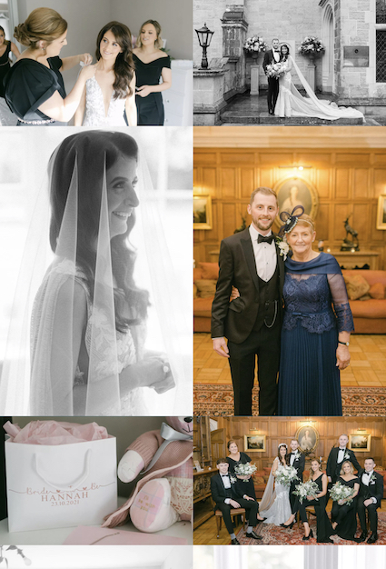

# Ashley & Hannahs Vow Renewal
***
[View Live project here](https://janebmckenna.github.io/milestone-project-1/)

Ashley & Hannahs Vow Renewal is a site that provides Wedding Day information for the friends and family of the couple. The website displays photos of the celebration which happened during COVID, information for guests coming to their renewal and collects RSVPs. 

## Index – Table of Contents
***
- [Ashley \& Hannahs Vow Renewal](#ashley--hannahs-vow-renewal)
  - [Index – Table of Contents](#index--table-of-contents)
  - [User Experience UX](#user-experience-ux)
  - [UX Strategy](#ux-strategy)
  - [UX Scope](#ux-scope)
  - [UX Structure](#ux-structure)
  - [UX Skeleton](#ux-skeleton)
  - [UX Surface](#ux-surface)
  - [Technologies Used](#technologies-used)
  - [Testing](#testing)
  - [Deployment](#deployment)
  - [Credits](#credits)

## User Experience UX
***
## UX Strategy

The **goal** is to  to provide a simple, intuitive and informative website for the vow renewal of Hannah and Ashley. Which guests will navigate easily to respond to their invitation, find useful information and browse images of the original wedding day during the covid 19 pandemic.

**Site Owners: Hannah and Ashley**

Website provides them with a means to communicate the details of their vow renewal, relive the moments from their wedding day, capture RSVPs and share content from the first time around.

**Users:**

Users are close friends and family of Hannah and Ashley they are interested in their story, viewing their pictures, RSVPing to their invite, the details of the day, what to expect and what accommodation is convenient.

**User Stories:**

_As a FIRST TIME user of the site I want to be able to:_
* Intuitively and easily navigate the site to find content.
* Respond with my RSVP.
* Be able to establish the particulars and timings of the vow renewal.
* Browse the photos of the original Wedding Day.

_As a RETURNING user of the site I want to be able to:_
* Confirm timings and arrangements for the day.
* Find links to accommodation and venues.
* Browse the photos of the original Wedding Day.

## UX Scope 
**Existing Features**

**Navigation Bar**

- Featured on all pages the design and layout of the navigation are consistent on each page. 
- On Mobile or small/medium screens there is a toggle button for the Navigation options. Users are familiar with this approach and it will be intuitive for them to use. 
- On desktop or large screen devices the navigation is expanded to show all the page options and the current page is subtly highlighted. 
- The Navigation will allow users to easily navigate the site without having to using the back button within the browser. 

**Home Page - Hero Image and Introductory Text**

- Provides a striking image of Ashley and Hannah immediately when the site is opened and sets the tone for the site. 
- Provides a clear explanation of why the vow renewal is happening and asks the user to join the celebration. 

**Home Page - Wedding Video**

- Builds excitement by showing the highlights of the original Wedding day.
- Gives a taste of what to expect to those who couldn't be at the original day.

**Footer**

- Provides easy access to links for the two venues for the day, the links will open in new tabs to aid user experience. 
- On large screens and desktops the date fo the Vow Renewal will also display. 

**The Plan**

- Provides details of the date, location and timings of the Vow Renewal. 
- Where and when the various aspects will occur.
- Full address and google maps links for the venues to make planning easier for guests. 

**Accommodation Suggestions**

- This will provide a list of a few suggestions for local accommodation including contact details and also a link to booking.com where additional options can be found. 

**RSVP Form**

- This will allow users to respond to their invite to the wedding, provide suggestions for great dance floor music and inform of any dietary requirements they may have. 

**Photo Gallery**

- This section will allow users to get a feel for what the day was like last time and importantly view photos Ashley and Hannahs special day.

**Future Improvements**

These features are beyond the scope of this project but I would look to include for the final live version of the site

- Active RSVP form.
- Guestbook to allow guests to comment and post well wishes. 

## UX Structure

**Navigation and Header**
Given how important Mobile view and responsive design is the Navigation will be housed within a collapsable icon with every page available with a single click from this menu. On all screen sizes the 'logo' will link to the home page but in addition on small mobile screens a 'Home' option will appear within the collapsable icon. 
The menu icons will highlight with active and hover. On larger screens the menu options are housed within a header in an extended format and available by a single click. 

**Links to external content**
All links to external content will open in a new tab to ensure there is a good user experience in naviagting the site. 

**RSVP Form**
When the RSVP form is submitted a thank you page which has a consistent layout with the remainder of the site will appear. This page will have the same navigation options as the core site. 

## UX Skeleton

**Design Choices**
- I envisaged that this site would predominantly be used on Mobile. I made the choice to use bootstrap to facilitate my design and I scaled from Mobile first.
- On desktop view I made the decision to allow the hero image to push the content below the fold. I felt the users of this site are a captive audience whom have a vested interest in seeing such a striking image of Ashley and Hannah. Where users had gone to the trouble of using a desktop to view the site I wanted this striking image to be their first and full view. 
- I tried to keep the layout as consitent as possible across screen sizes whilst also ensuring the content was well presented and visually pleasing across devices. 
- In order to make it easy for users to remind themselves of the locations for the vow renewal, I kept the names (and links) in the footer across all pages. I felt that if someone was naviagting to the Castle for example on the day and forgot the name this would allow them to quickly remind themselves. 

  
**Wireframes**

[View Wireframes](wireframes.md)

## UX Surface

**Colour Pallette**
As I have fixed imagery that I wanted to use on the site I want the colour pallette on the site to compliment the imagery. I have chosen my primary colour for the site rgba(0, 102, 111, 0.99) I will use contrasting and complimentry colors. I also want to use some different transparency to break up the colour. 

**Fonts**
To fit with the grandure of the occassion I have chosen Dancing Script to be used at key points in the project. For accessibility reasons and too ensure that the script is not overly cursive I have chosen Roboto to compliment this and to be used through that majority of the site. 

**Effects**
- To enhance the hero image on the home page I have decided to impliment a zoom effect when the page is navigated to.
- To ensure users recieve a que that links are clickable I have decided to underline the text when the user hovers. 
- To make naviagtion easy the active page with subltely embolden when active. 

**Responsiveness**
I replied heavily on a combination bootstrap and media queries to ensure the site was visually appealing and well laid out on all screens. 

## Technologies Used

- **Languages:** HTML, CSS
- **Code Anywhere:** used as a cloud code editor.
- **GitHub:** used as a cloud based code repository.

## Testing

[View Testing Documentation](testing.md)

## Deployment
The Website has been deployed using GitHub Pages [Here](https://janebmckenna.github.io/milestone-project-1/) using the method below: 
- I logged into my GitHub account.
- I opened my repository for this site. 
- Within the repository I selected 'Settings'
- I navigated to 'Pages' within 'Settings'
- I selected 'Deploy from a branch' from the source menu then the 'Main' branch along with the 'root' folder.
- I then saved the options to deploy the site. 

To deploy this website using source files:
- Go to the repository [Here](https://github.com/janebmckenna/milestone-project-1/tree/main)
- Clone the repository onto your local device by
  - Click 'Code'
  - Chose 'Download Zip'
- Open the Zip file on your device
- Right click on the 'index.html' file and open with any browser. 

If you wish to create a fork of this repository advice can be found [here](https://docs.github.com/en/get-started/quickstart/fork-a-repo)
  
## Credits

**Content**

- I used [colormind.io](http://colormind.io/) to decide on the colour scheme of the site. I wanted the palette to fit with the imagery I intended to use.
- Icons were sourced from [Font Awesome](https://fontawesome.com)
- My fonts were taken from [Google Fonts](https://fonts.google.com/)
- [Bootstrap Version 4.3](https://getbootstrap.com/docs/4.3/getting-started/introduction/)
- Wireframes were created using [Balsamiq](https://balsamiq.com/)

**Code**

- While writing the project I referred back to pieces of code I had written during the course. 

    **Gallery Page**
    I liked the layout of the Gallery on the love running project so I referred 
    back to to to guide my code for the Gallery on this site. I felt however 
    that 3 columns was more appropriate for tablet view. 

    **Plan Page**
    I felt the code from my resume project which showed the timeline of 
    employment was a nice execution of a timeline. I referenced back to this 
    code to write the code for the Plan page. 

- Youtube video

I took the embed code for the youtube video I wanted to use and edited the code for my own needs. I changed the display properties, the accessibility and the attributes for the code. 

- Google Maps

I took the embed code from Google Maps for the two locations I needed for the project. I then added a title for accessibility purposes. 

- Meta Description

I used [this](https://developer.chrome.com/en/docs/lighthouse/seo/meta-description/) lighthouse help document to understand how add a meta description to the head.

- Markdown Language

I used [this cheat sheet](https://www.markdownguide.org/cheat-sheet/) to help me write my README file. 

**Images**

All images used within the project came from personal sources. The wedding imagery is from Ashley and Hannahs Wedding and was used with their permission. The three accommodation images were sourced from the marketing department at work and used with their blessing to create fictitious accommodation in Mohill. 
I thank my sister Hannah, brother in law Ashley and Marketing Manager Ross for their assistance in providing photography. 

**Advice**

Thank you to my mentor for all the help and advice he has offered including:
- An elegant solution for form submission on a static site. 
- Advising on the correct testing format.
- Advising on the layout, look and feel.