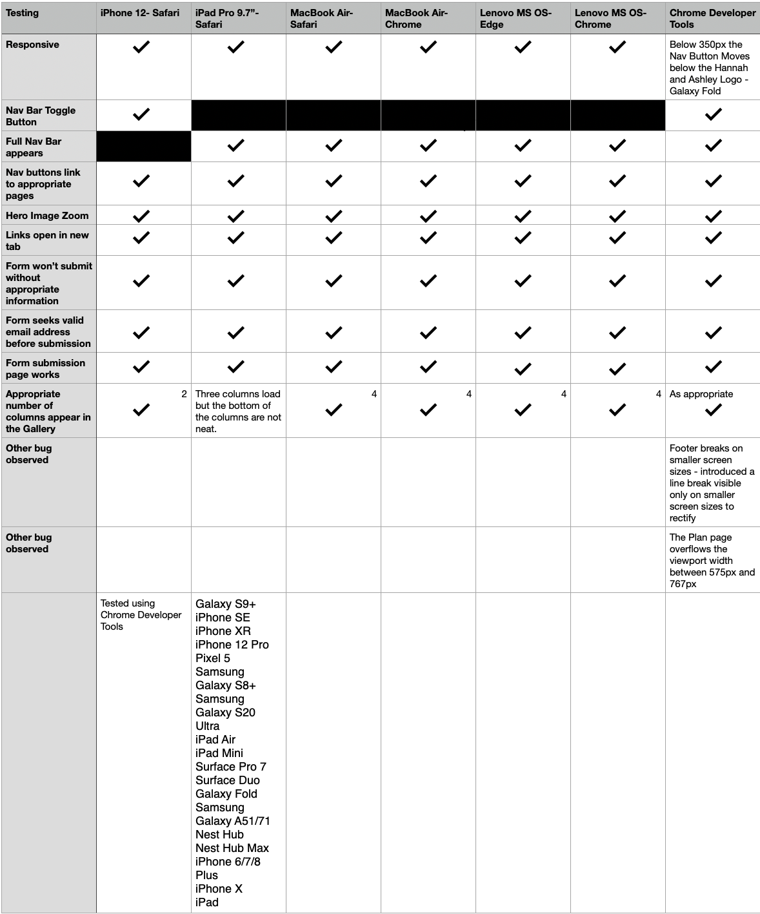
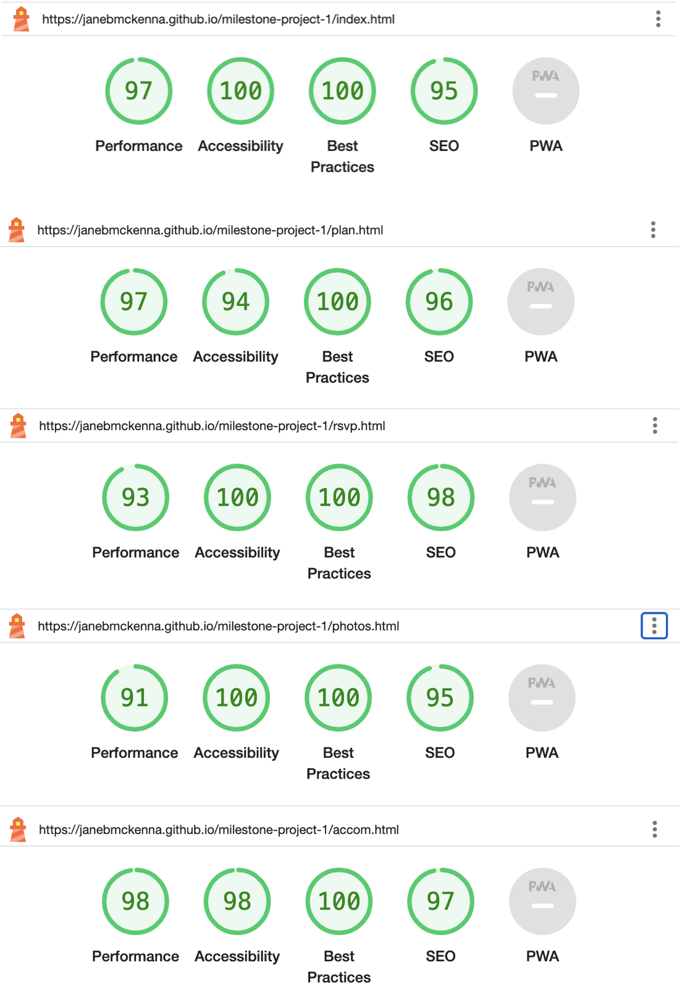
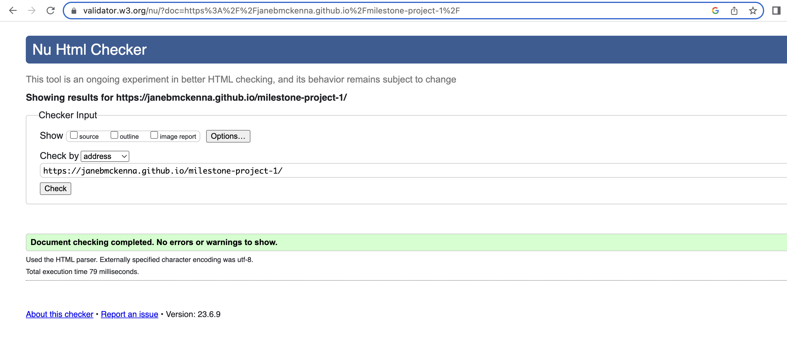
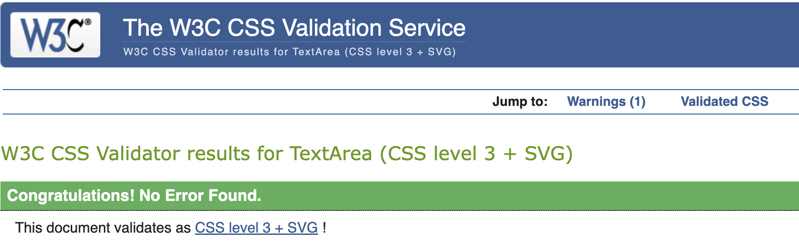

# Testing 

[Return to README](README.md)

## Contents
[Manual Testing](#manual-testing) \
[User Story Validation](#user-story-validation) \
[Lighthouse Audit](#lighthouse-audit) \
[Validator Testing](#validator-testing)\
[Bugs](#bugs)

## Manual Testing
**Device and Browser Testing**

**Manual Testing of User Actions**

|**Feature**     |**Action**     |**Expected Bahaviour**     |**Result**     |
|----------------|---------------|---------------------------|---------------|
|NavBar          |Click Logo     |Navigates to homepage      |Pass           |
|NavBar          |Click The Plan |Navigates to The Plan page |Pass           |
|NavBar          |Click Accommodation |Navigates to The Accommodation page      |Pass           |
|NavBar          |Click RSVP     |Navigates to The RSVP page      |Pass           |
|NavBar          |Click Gallery     |Navigates to The Gallery page      |Pass           |
|NavBar          |Hover over The Plan |Text becomes bold |Pass           |
|NavBar          |Hover over Accommodation |Text becomes bold |Pass           |
|NavBar          |Hover over RSVP |Text becomes bold |Pass           |
|NavBar          |Hover over Gallery |Text becomes bold |Pass           |
|Mobile Menu     |Click The Hamburger Icon |Displays Menu items |Pass           |
|Mobile Menu     |Click The Hamburger Icon a 2nd time     |Collapses Menu items      |Pass           |
|Mobile Menu     |Click Home |Navigates to The Home page |Pass           |
|Home Page - Video |Click Play Icon |Video plays on mute  |Pass           |
|Footer          |Click St Macarthans Cathedral |Homepage for St Macarthans Cathedral opens in a new tab |Pass    |
|Footer          |Click Lough Rynn |Homepage for Lough Rynn opens in a new tab |Pass    |
|Footer          |Hover over St Macarthans Cathedral |Text Underlines |Pass    |
|Footer          |Hover over Lough Rynn |Text Underlines |Pass    |
|Plan - Location information |Click St Macarthans Cathedral |Homepage for St Macarthans Cathedral opens in a new tab |Pass    |
|Plan - Location information |Click Lough Rynn |Homepage for Lough Rynn opens in a new tab |Pass    |
|Plan - Location information |Hover over St Macarthans Cathedral |Text Underlines |Pass    |
|Plan - Location information |Hover over Lough Rynn |Text Underlines |Pass    |
|Plan - Location information |Click St Macarthans Cathedral Map|Google Maps location for St Macarthans Cathedral opens in a new tab |Pass    |
|Plan - Location information |Click Lough Rynn Map |Google Maps location for Lough Rynn opens in a new tab |Pass    |
|Accommodation Information   |Click Castle |Homepage for Lough Rynn opens in a new tab |Pass    |
|Accommodation Information   |Click Booking.com |Homepage for booking.com opens in a new tab |Pass    |
|Accommodation Information   |Hover over Castle |Text Underlines |Pass    |
|Accommodation Information   |Hover over Booking.com |Text Underlines |Pass    |
|Accommodation Information   |Click accommodation photo |Booking.com opens in a new tab|Pass    |
|RSVP Form     |Click Send! without providing Name details |Pop up: Please Fill in this Field |Pass    |
|RSVP Form     |Click Send! without providing Email details |Pop up: Please Fill in this Field |Pass    |
|RSVP Form     |Click Send! with non email text in email field|Pop up: Please include an '@' in the email address |Pass    |
|RSVP Form     |Click Send! without toggling a radio button |Pop up: Please select one of these options |Pass    |
|RSVP Form     |Click Send! with Name, Email and RSVP response provided |Thank you page appears |Pass    |

## User Story Validation

|**User Story** |**Outcome** |
|-----|-----|
|_Website provides them with a means to communicate the details of their vow renewal, capture RSVPs and share content from the first time around._|The Website delivers all the objectives for the owners of the Site Ashley and Hannah. It contains all pertinent details of their vow renewal, captures RSVPs and shares photos and video.|
|**First Time User**||
|_Intuitively and easily navigate the site to find content._|The site is laid out in a familiar and intuitive format, feedback from testers is that the site was easy to navigate.|
|_Respond with my RSVP._|Form provided to allow users to RSVP, this is currently set up mimic gathering RSVPs but appears to work to users of the site. The backend development to gather and store this information is beyond the scope of this project.|
|_Be able to establish the particulars and timings of the vow renewal._|The date and location of the vow renewal is provided at several points during the navigation journey through the site. The full details are provided on an easy to navigate to and through plan page.|
|_Browse the photos of the original Wedding Day._|A full gallery of photos is included within the site, this page is responsive and displays well on all screen sizes.|
|**Returning User**||
|_Confirm timings and arrangements for the day._|Timings and details are provided on an easy to navigate to and through plan page|
|_Find links to accommodation and venues._|Accommodation suggestions are provided on an easy to navigate to and through accommodation page|
|_Browse the photos of the original Wedding Day._|A full gallery of photos is included within the site, this page is responsive and displays well on all screen sizes.|

## Lighthouse Audit

When I initially ran the lighthouse audit I found issues with:
- My images sizes impacting load time, I rectified this by resizing the images and changing the format from .img to .WebP.
- Meta Description in the head for SEO, which I rectified.
- Lack of Title on my iframes, which I rectified. 

Following my work to rectify my final lighthouse audit results are below

## Validator Testing

- HTML

No errors were returned when passing through the W3C validator 

- CSS

When I initially passed the site through the Jigsaw Validator it returned a lot of errors originating from bootstrap/java script. I made the decision to test my CSS directly through direct input on the validator. 

Initially one error was found, there was a Parse error on line 275 of my css file. I had missed the second closing curly bracket on my zoom on my hero image. 

After fixing this, no errors were returned when passing through the validator by direct input for a final time.  

**Peer Review**

I reached out to both my cohort and the peer code review channel on slack to gather any feedback and observations on my site and code, I thank all those who took the time to review my work. Additionally I would like to thank my friends and family for taking the time to review the website as a user.

## Bugs

**Resolved Bugs**

|**Bug**|**Resolution**|
|-----|-----|
|Footer not sticking to the bottom of the viewport|Set the min viewport height to 100% and the top margin of the footer to auto |
|Navigation items not displaying as desired|Used bootstrap to implement a collapsable hamburger icon for the navigation on Mobile devices, Changed the title of Plan page from 'Plan for the Day' to 'The Plan' |
|Form overflowing the window on Mobile|Reduced the columns for the input window from 40 to 35 |
|Footer breaks on screens below 400px|Introduced a line break between the two location links|
|Below 350px the Hamburger icon moves below the Ashley and Hannah Logo.| I used a media query to revise the logo and padding for the logo below 350px|
|Untidy photo layout in Gallery on tablet devices (3 columns)|I used a media query to hide two images which tidied up the page|

**Unresolved Bugs**

The plan page overflows the viewport width between 575px and 767px, pushing the menu icon off the side of the page. 

[Return to README](README.md)